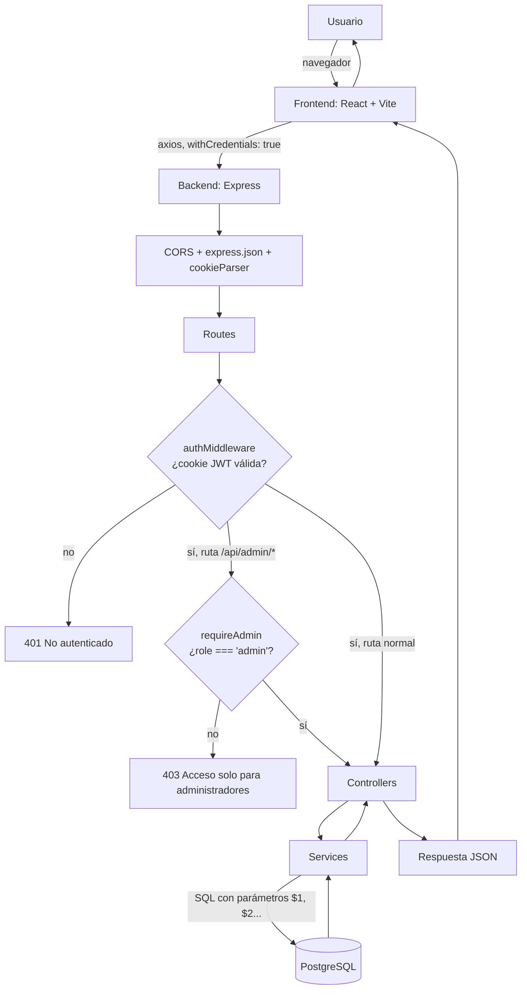
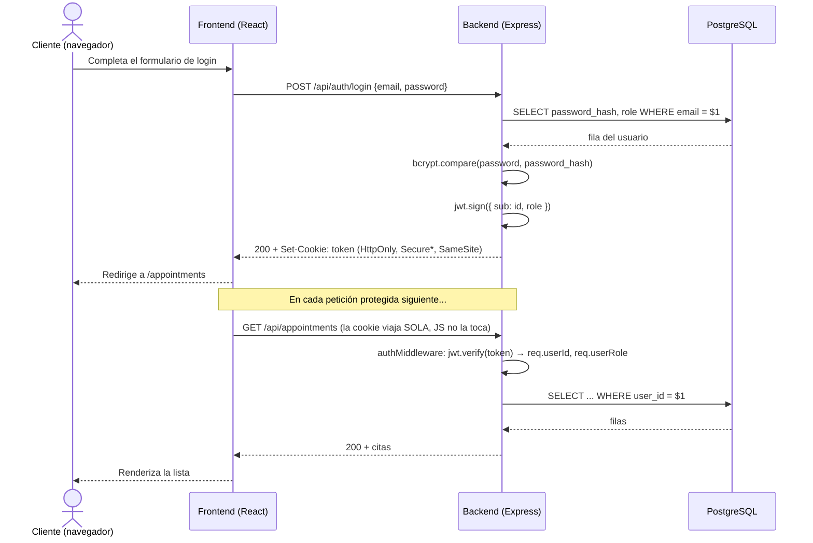
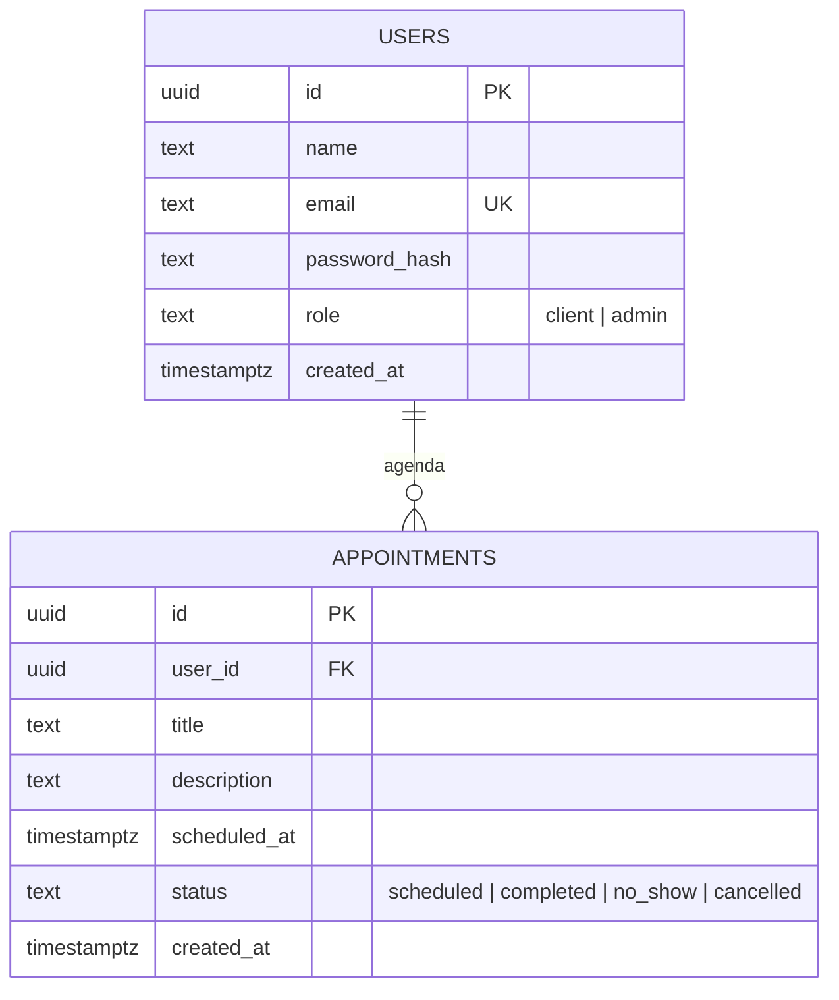
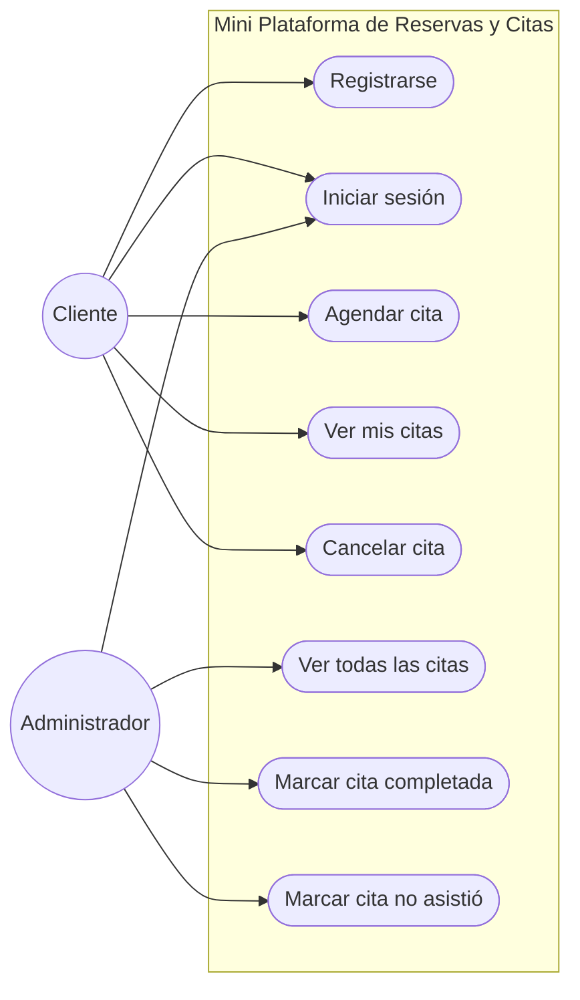
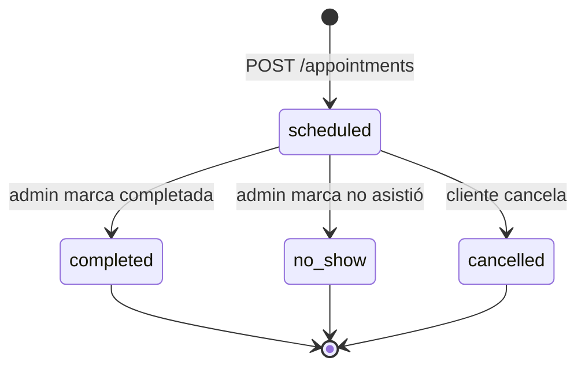

# 📊 Diagramas de arquitectura

Estos diagramas son material de **referencia visual**, no un step secuencial — puedes leerlos ahora para tener el mapa completo antes de empezar, o al final como repaso. Están en formato [Mermaid](https://mermaid.js.org/), que GitHub y la vista previa de Markdown de VSCode renderizan de forma nativa (abre este archivo con `Ctrl+Shift+V` en VSCode).

## 1. Flujo general de la aplicación

Cómo viaja una petición a través de las capas (ver [Step 03](step-03-backend-arquitectura-capas.md) y [Step 09](step-09-roles-de-usuario-y-estados-de-citas.md)):

## 2. Flujo de autenticación

Desde el login hasta una petición protegida, incluyendo por qué el token nunca toca `localStorage` (ver [Step 04](step-04-auth-jwt-httponly-cookies.md)):

## 3. Diagrama entidad-relación

El modelo de datos completo, incluyendo `role` y `status` del [Step 09](step-09-roles-de-usuario-y-estados-de-citas.md):

> El índice único es parcial (`WHERE status <> 'cancelled'`) y por eso no se puede expresar como una simple marca `UK` en este diagrama — ver el detalle en el Step 09.

## 4. Casos de uso

diagrama UML "casos de uso"; lo aproximamos con un flowchart que separa actores, un límite de sistema (`subgraph`) y las acciones disponibles para cada rol:

## 5. Estados de una cita

El ciclo de vida completo de una cita, introducido en el [Step 09](step-09-roles-de-usuario-y-estados-de-citas.md):

Nota que **todas** las transiciones parten de `scheduled` — ninguna ruta permite, por ejemplo, pasar de `cancelled` a `completed`. Eso es exactamente lo que garantizan los guards `WHERE status = 'scheduled'` en `appointments.service.js`.
